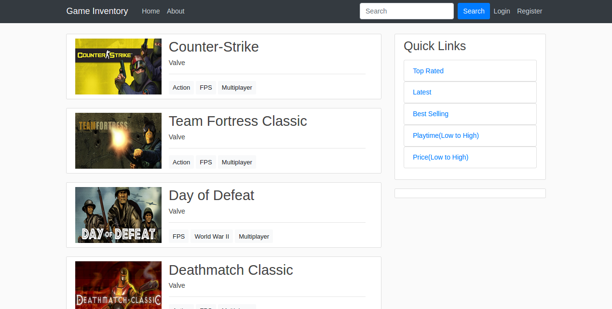
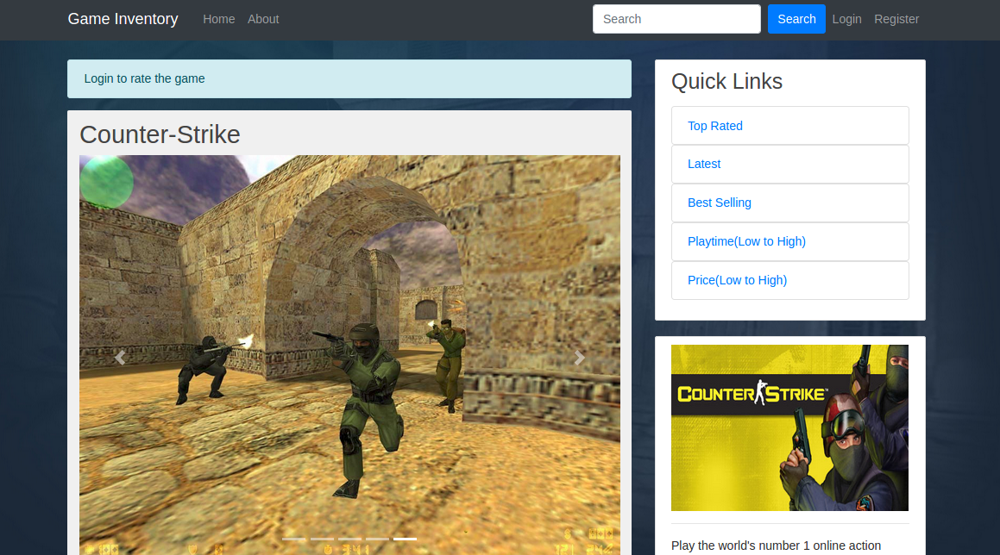
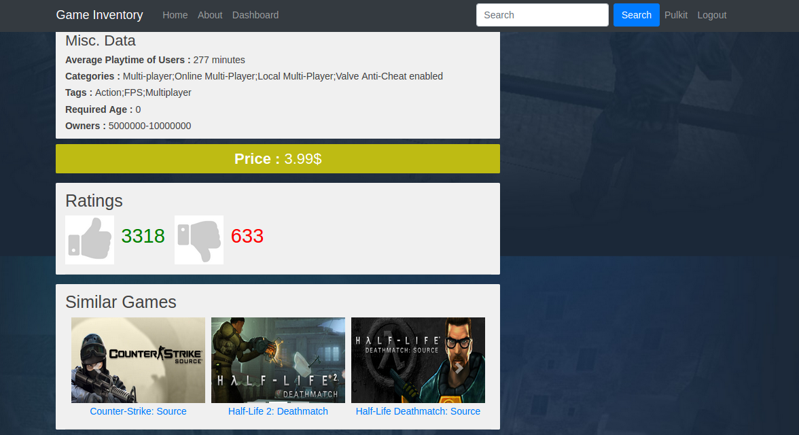
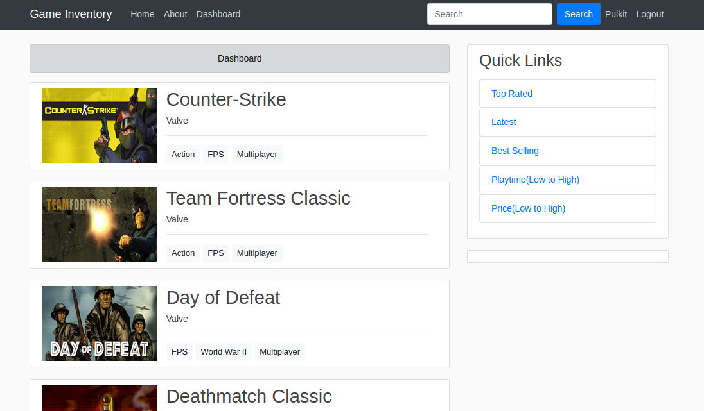

# game_inventory
DBMS project 

Requirements: 
Flask, psycopg2, flask_bootstrap, flask_wtf, wtforms, flask_login 

Database dump can be found at: 
https://drive.google.com/open?id=1Et2ALDtEZ_zYyWYyRKa8or2OgEvP3ejb  

For loading the database in psql:  
psql <db_name> < <dump.sql>

To run the flask app:  
python server.py  

<h4>Home page</h4>
  
The home page of our navigator is a simple list of few random games with the genre of each game attached to it.  The right side of our home page consists of a small quick links bar which links to top games based on various parameters(like top 10 most played,etc).On the top is a task bar which consists of our custom search along with our register and login tabs(in caseuser is in anonymous mode) or name and logout tabs(in case user is already logged in).

  <h4>Game page</h4>
  
This page lists all the details of a particular game.  The top task bar and quick link bar on the left remains the  same.   We  first  see  a  set  of  5  screenshots  from  the  game  followed  by  an  brief  overview,  minimum requirements, platforms and other miscellaneous data.For users who have logged in, they can add the game to the list of already owned games and then review it which gets added to our database. Finally, we have a list of similar games(the list which we see at amazon and other shopping sites) for users to see games of similar category.

  <h4>Quick Links</h4>
  
The right hand side of each page(other than login and register) consists of a series of links for Top rated,latest, best selling and other categories of games which redirect user to a page containing each of these in sorted order.

  <h4>Login and Register page</h4>
  
The Register page asks the user to enter a name and a password using which he/she will make an account.Since the name is our primary key and should be unique, an error will be thrown and user will be notified to enter another value. The login page asks user to enter valid name and password, which are then verified using our database. After login, the user is redirected to the dashboard page which consists of the games a user already owns.

  <h4>Dashboard</h4>
  
This page consists of the list of games which a user already owns.  The layout is similar to that of the homepage.

